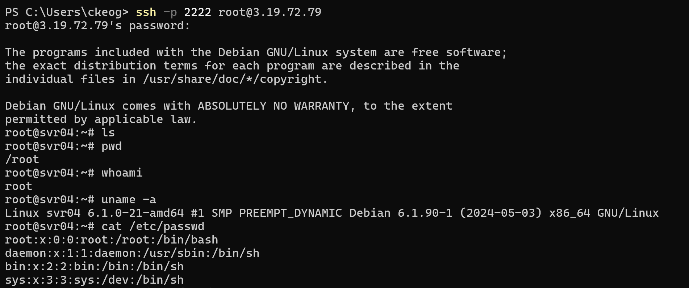
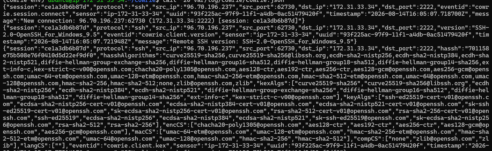
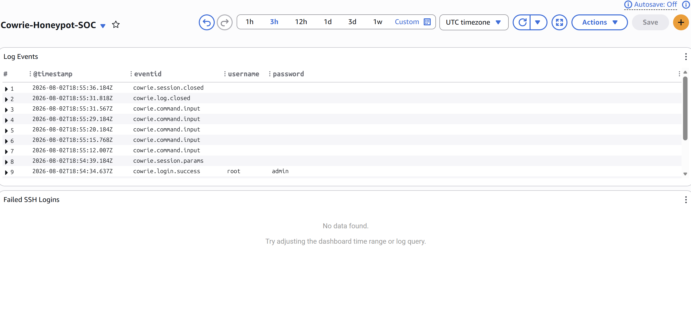
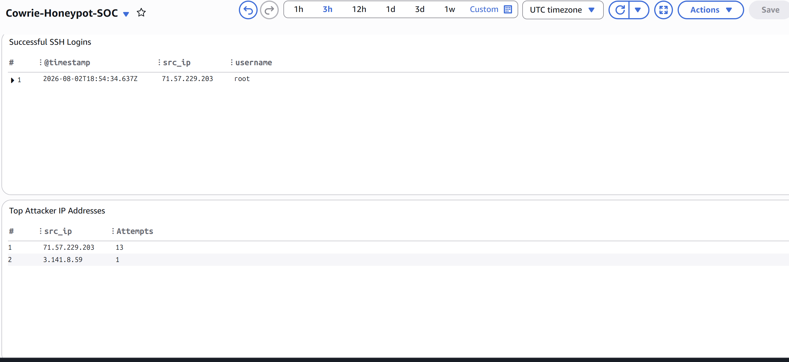
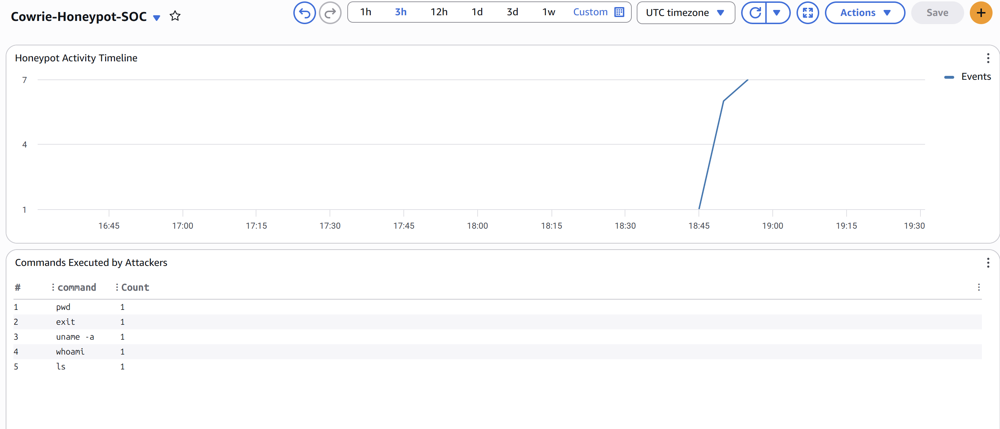
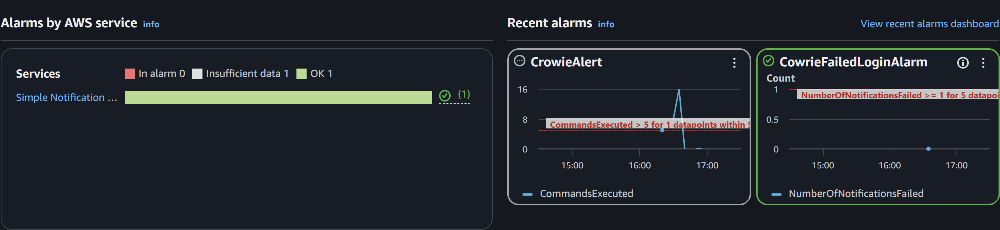
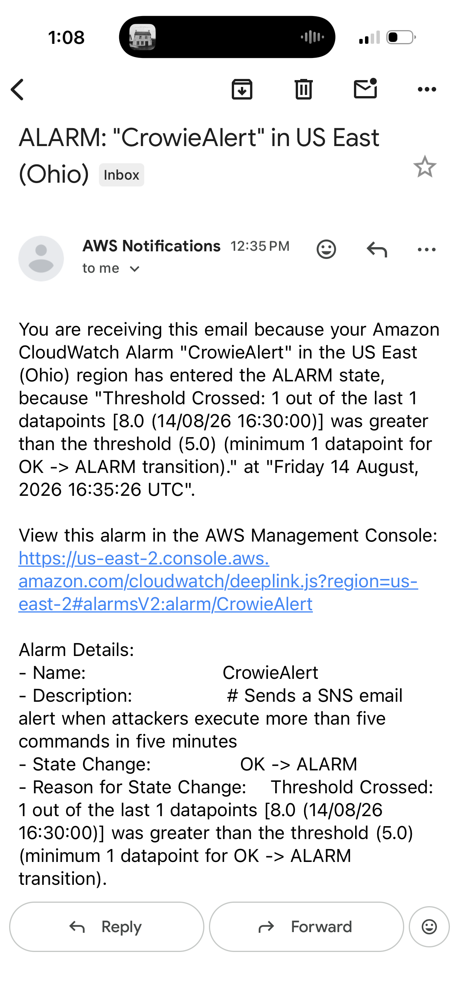
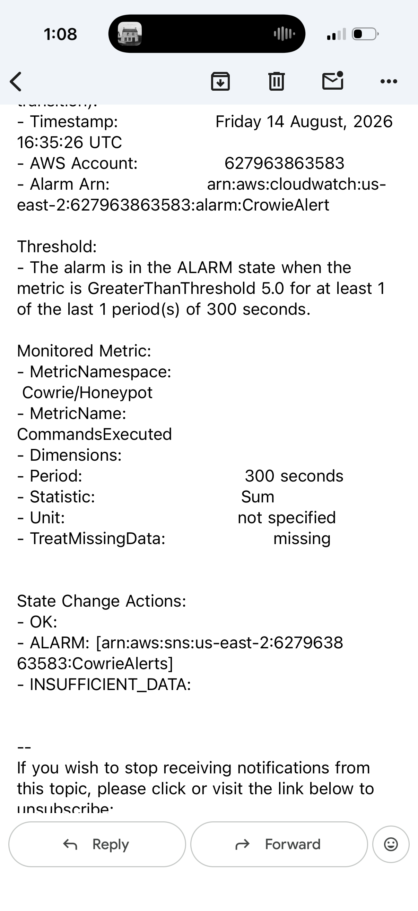
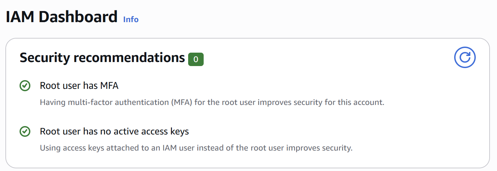

# AWS Cloud Honeypot & Threat Monitoring Platform

## Overview

This project is a cloud-based SSH honeypot built with AWS EC2, Cowrie, Amazon CloudWatch, CloudWatch Logs Insights, metric filters, alarms, Amazon SNS, and Python.

The project captures SSH authentication and command activity, forwards structured Cowrie telemetry into CloudWatch, visualizes activity through a SOC-style dashboard, detects elevated command execution, and sends automated email alerts.

## Architecture

EC2 → Cowrie → CloudWatch Logs → Dashboard → Alerts

## Technologies

- AWS EC2
- Ubuntu Linux
- Cowrie SSH Honeypot
- Amazon CloudWatch
- CloudWatch Logs
- CloudWatch Logs Insights
- CloudWatch Metric Filters
- CloudWatch Alarms
- Amazon SNS
- AWS IAM
- Python
- SSH
- JSON

## Features
This project accomplishes the following objectives: 
- Capturing SSH authentication attempts
- Recording commands executed inside a honeypot environment
- Collecting structured JSON security telemetry
- Centralizing logs in Amazon CloudWatch
- Querying activity with CloudWatch Logs Insights
- Building a SOC-style security dashboard
- Creating detection logic using metric filters
- Triggering CloudWatch alarms from suspicious activity
- Sending automated email notifications through Amazon SNS
- Analyzing Cowrie logs with Python

## EC2 Configuration

The EC2 security group separates administrative access from honeypot traffic:

| Port | Service | Source | Purpose |
|------|---------|--------|---------|
| 22 | SSH | Restricted IP | EC2 administration |
| 2222 | Cowrie SSH | Internet | Honeypot traffic |

Administrative SSH access is restricted while the Cowrie service is intentionally exposed on TCP port 2222.

## Cowrie Configuration
Cowrie listens for incoming SSH connections on port 2222.

[ssh]
listen_endpoints = tcp:2222:interface=0.0.0.0

A sanitized example configuration is available here:

config/cowrie.cfg.example

Cowrie records structured events in:

/home/ubuntu/cowrie/var/log/cowrie/cowrie.json

Common events include:

cowrie.session.connect
cowrie.login.success
cowrie.login.failed
cowrie.command.input
cowrie.session.closed

## Honeypot Testing
A controlled SSH connection was used to verify that Cowrie was accessible externally and correctly capturing activity.

Example connection:

Commands entered within the simulated environment were recorded by Cowrie as security events.

## Cowrie JSON Logging
Cowrie produces structured JSON telemetry containing fields such as:

- Timestamp
- Event ID
- Source IP
- Source port
- Username
- Authentication activity
- Commands entered
- Session information

Sample of the logs:

## CloudWatch Log Collection
The Amazon CloudWatch Agent runs on the EC2 instance and forwards:

/home/ubuntu/cowrie/var/log/cowrie/cowrie.json

to the cowrie-honeypot CloudWatch log group.

Each EC2 instance uses a separate CloudWatch log stream and receives CloudWatch permissions through an IAM instance role, avoiding the need to store AWS access keys directly on the server.

## SOC Monitoring Dashboard
The CloudWatch dashboard provides visibility into the honeypot activity.

It includes:
- Honeypot activity timeline
- Top connection source IPs
- Successful honeypot logins
- Most common usernames
- Most common commands

## Detection Engineering
A CloudWatch metric filter monitors Cowrie command execution events.

Metric Filter Pattern: { $.eventid = "cowrie.command.input" }
Namespace: Cowrie/Honeypot
Metric Name: CommandsExecuted
Metric Value: 1

Every cowrie.command.input event increments the custom CloudWatch metric.

## Automated Security Alerting
A CloudWatch alarm monitors the custom CommandsExecuted metric.

If five or more commands are recorded within a five-minute period, the CloudWatch alarm enters the ALARM state.

## Amazon SNS Notifications
The CloudWatch alarm is connected to an Amazon SNS topic.

When the alarm enters the ALARM state:

Cowrie Activity -> CloudWatch Metric Filter -> CommandsExecuted Metric -> CloudWatch Alarm -> Amazon SNS -> Email Notification

Example of email notification: 

## Python Log Analysis 
A Python script created utilizing Claude Code performs additional analysis directly against Cowrie JSON logs.

Script:

scripts/analyze_logs.py

The script extracts and counts:
- Cowrie event types
- Connection source IPs
- Usernames
- Commands executed

## Security Considerations
Since this project intentionally exposes a honeypot to the internet, the following precautions were taken:
- Administrative SSH access is separated from honeypot traffic.
- Port 22 is restricted to a trusted source IP.
- Cowrie is exposed separately on TCP port 2222.
- AWS permissions are provided through an IAM instance role.
- AWS access keys are not stored on the EC2 instance.
- Private SSH keys are excluded from source control.
- Cowrie authentication databases are excluded from the repository.
- Raw Cowrie logs are excluded from source control.
- Sensitive information is not included in public repo

## Skills Acquired
Cloud Security
- AWS EC2
- IAM roles
- Security groups
- CloudWatch
- Amazon SNS

Cybersecurity
- Honeypots
- SSH security
- Security monitoring
- Log analysis
- Detection engineering
- Automated alerting
- SOC-style workflows

Technical
- Linux administration
- Python
- JSON
- CloudWatch Logs Insights
- Networking
- GitHub documentation

## Lessons Learned 
This project showed me how individual security components can be combined into an end-to-end monitoring pipeline. It also showed me the importance of visualizing results and data.

Troubleshooting EC2 connectivity reinforced the importance of understanding the relationship between:
- Public IP addressing
- Security groups
- SSH services
- Listening ports
- IAM permissions
- Cloud networking

